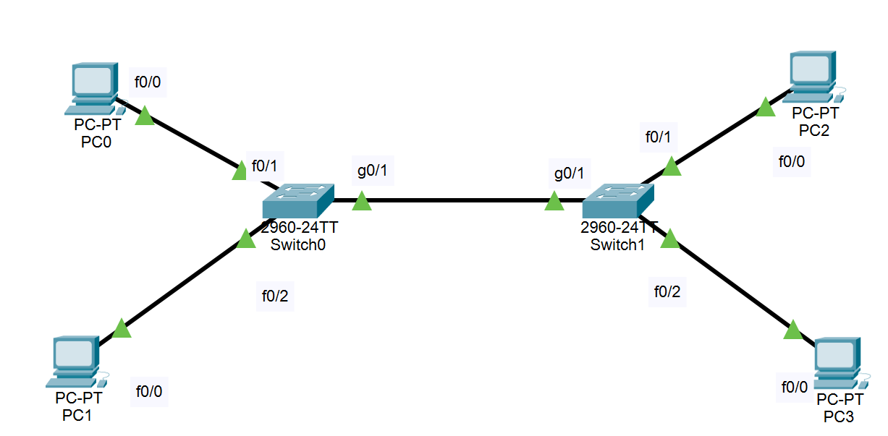
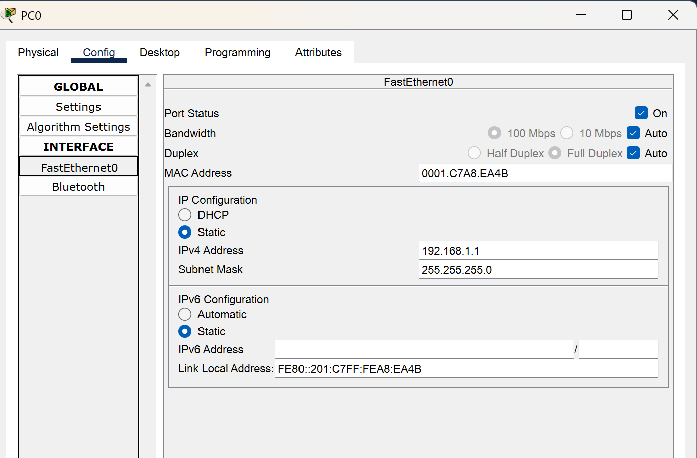
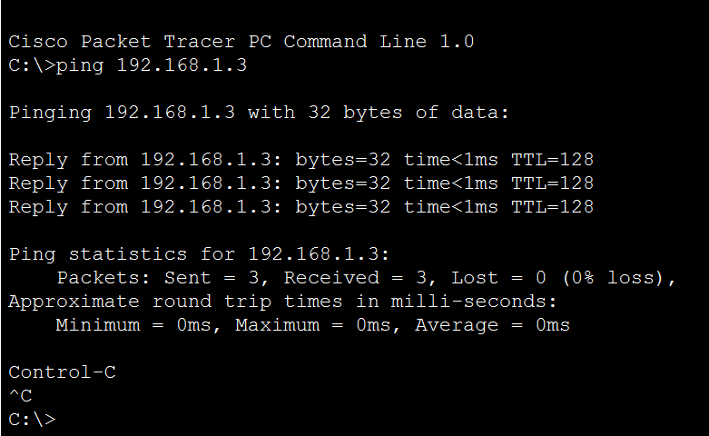
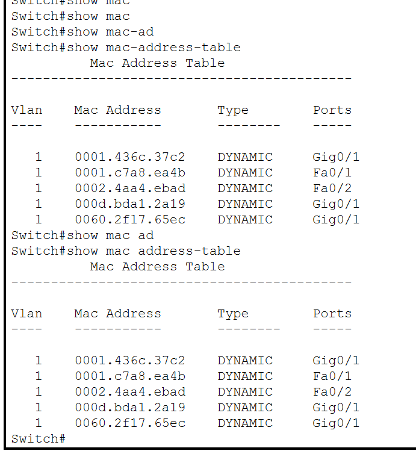
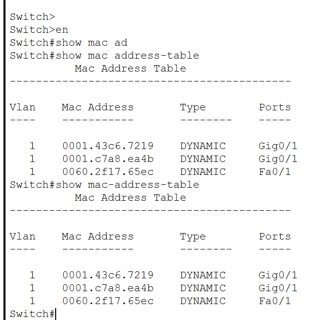
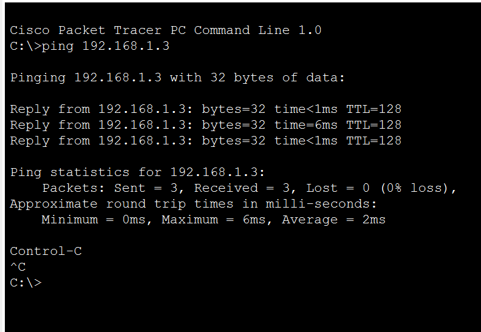
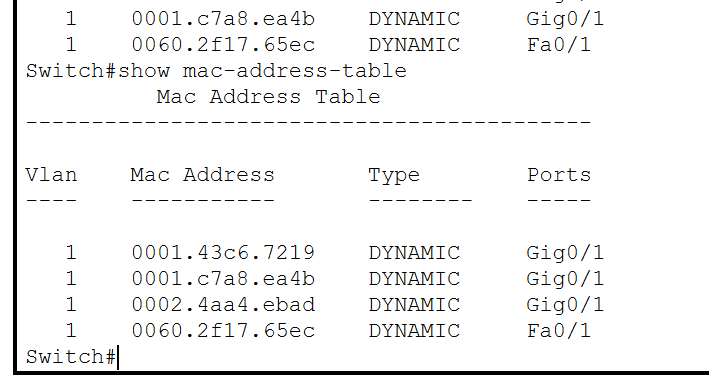
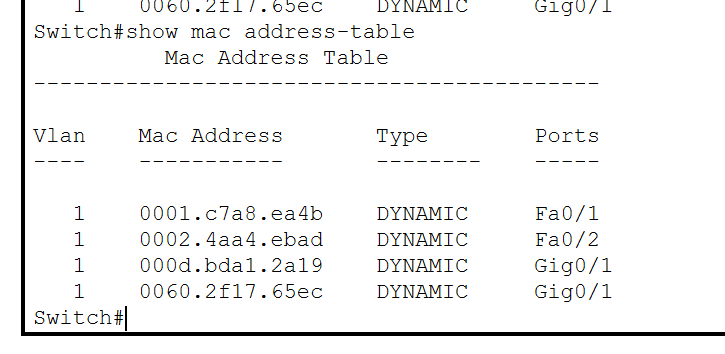
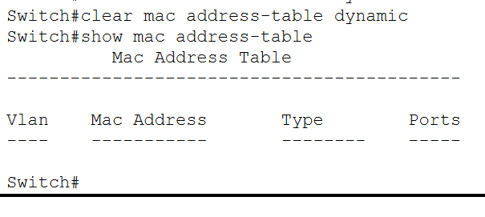

In this lab, I will design a basic 4 pc and 2 switch architecture and explore the mac-address table configuration and commands.

      

i have to assign the ip to each other pc and for that i will use the GUI.

      

in this image you can see that in pc0 i have assigned 192.168.1.1/24 ip and this whole network runs on 192.168.1.0/24 network.

here is a ping result from SW0 to SW1 side of computer/pc (PC0 to PC2 )

    

after ping we can see the mac-address table using this command

in SW0

    

in SW1

     

let's do ping from PC1 to PC3

    

after this let's check the mac-address table in both the switches

SW1

     

SW0

now to clear this table manually using command we use this command

thank you,
thesahilsinh