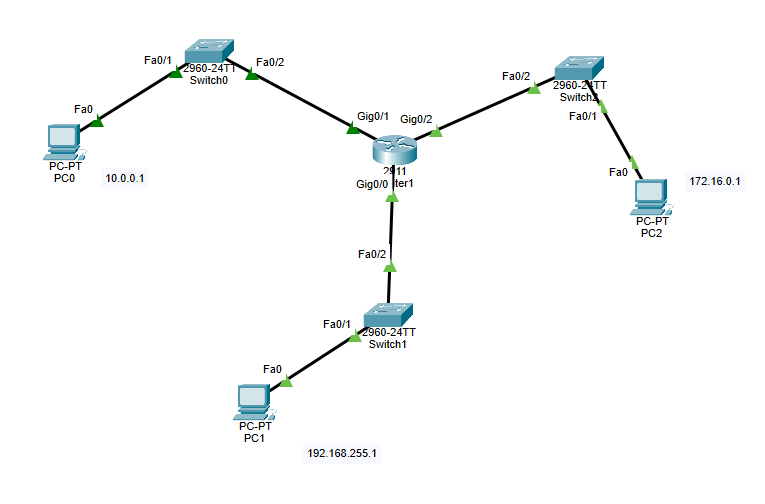
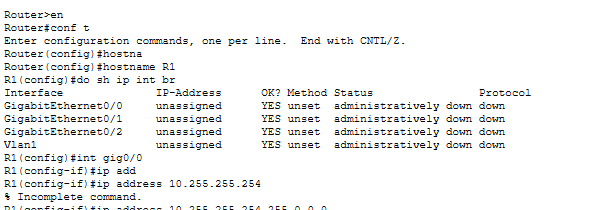
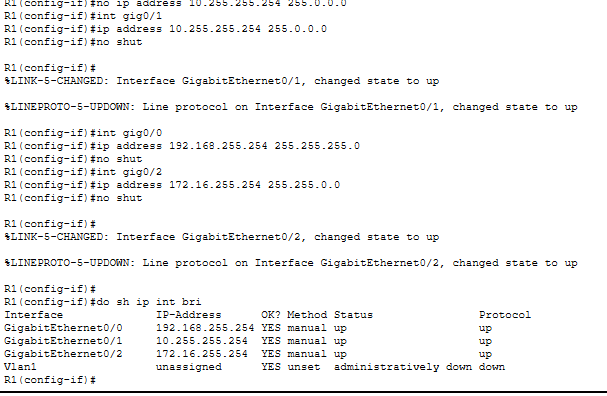
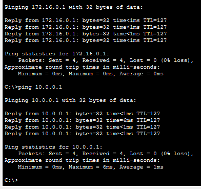

This lab is a part of the playlist, and right now i am on day 8, so this lab contains lab 8 learnings.   

Notes:   
Part 1-  

- It expains about IPv4 numbering system and how to translate from bits to decimal to hex and vice a versa   
- how network and host portion calculated using net mask.   
- IPv4 classes A, B, C, D, E

Part 2 -

- how to calculate network address, host address, first/last usable address,  using class based example.   
- command to assign IPv4 address on cisco device
    - show ip interface brief
    - interface gig 0/0
    - ip address 10.0.0.1 255.0.0.0
    - description connect to SW1

Now the LAB 2 - DAY 8 lab starts from here...    

So i have design this architecture and assign pc0 a class A, pc1 a class C, pc2 a class B private IP address.

Now i am going to assign each interface a network address using router which help to connect those network and routes the traffic in networks.

than i assigned ip address to this router

after assigning the ip address to router we need to assign the same ips as a gateway into each corresponding PCs. so in that way they can communicate with each other.

ping from PC1 to 0 and 2

here the lab ends.

thank you,
sahilsinh