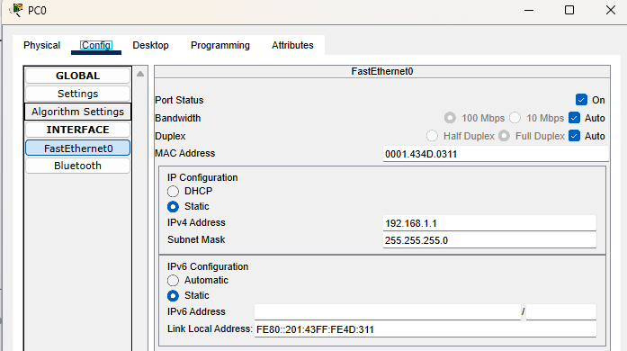
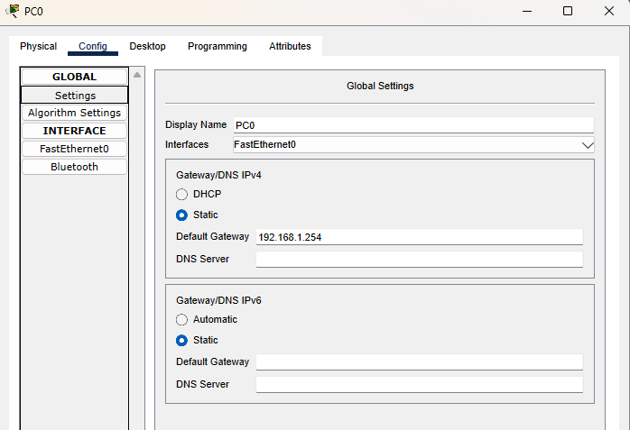
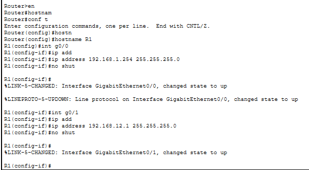
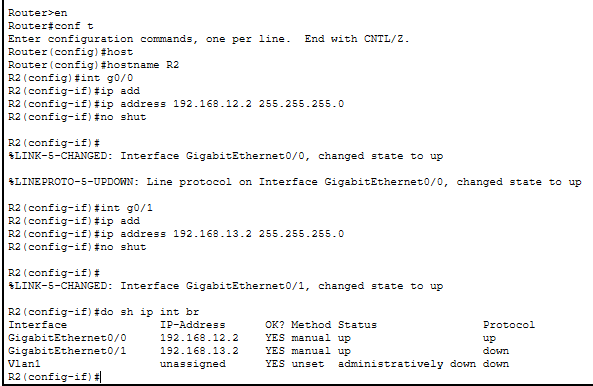
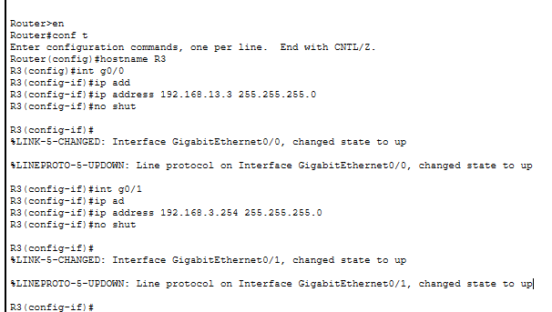
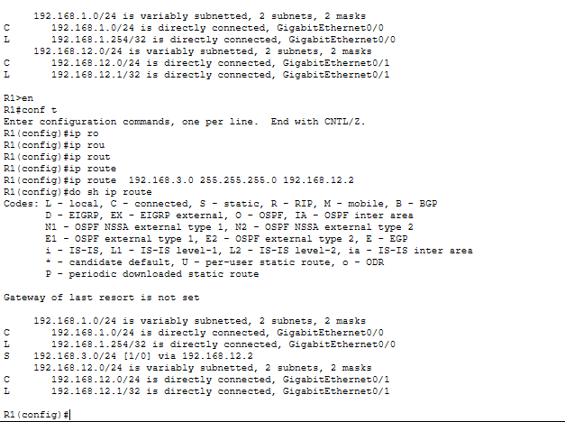
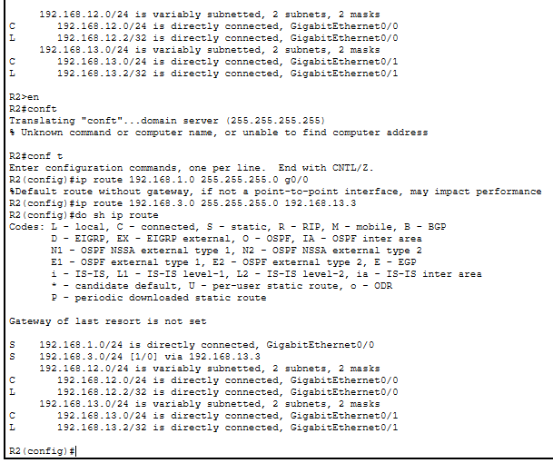
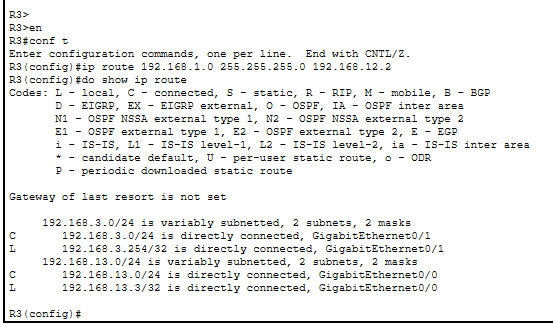
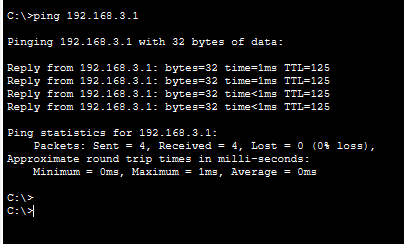

In this lab we configure the static routes

PC 0 configs

R1 configs

R2 configs

R3 configs

Basic network config is done now let's make the routes

R1 route is done.

R2 route is done.

R3 route is done.

Let's test this route using ping

from pc 1 to pc 2

I failed at first because in R3 config i have misconfigured next-hop IP :)!